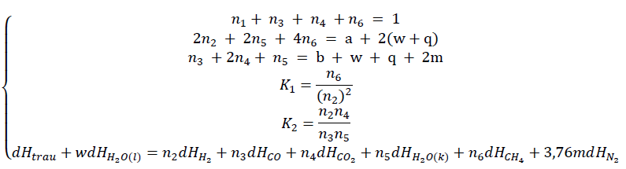

# Newton Raphson solve system of equations and Regression models.

## Problem definition
----


In that:
- `𝑎,𝑤,𝑞,𝑑𝐻𝑡𝑟𝑎𝑢,𝑑𝐻𝐻2𝑂(𝑙),𝑑𝐻𝐻2𝑂(𝑘) is constants`.
- `𝐾1,𝐾2,𝑑𝐻𝐻2,𝑑𝐻𝐶𝑂,𝑑𝐻𝐶𝑂2,𝑑𝐻𝐻2𝑂,𝑑𝐻𝐶𝑂2,𝑑𝐻𝐶𝐻4 ,𝑑𝐻𝑁2` is the parameters determined when know `ER` and `T2`
- `n1, n2, n3, n4, n5, n6` are solution we need to found.

### Required tasks:
- Task 1. Find the solution of system of equations.
- Task 2. Plot the representtion graph of n1, n2, n3, n4, n6 at the particular T2 value when ER change.
- Task 3. Regression the representation equation of `n1, n2, n3, n4, n6` with predictors are `T2, ER`
- Task 4. Calculate the RMSE (Root mean square error) of regression equations found in task 4.

## Solving
-----
### 1. Solve the system of equations given ```T2, ER```.
```bash
  python main.py -ER <Value of ER> -T2 <Value of T2>
```
For example, we want find the solution [n1,n2,n3,n4,n5] at `ER = 0.2 and T2 = 750`, just enter the following command:
```bash
  python main.py -ER 0.2 -T2 750
```
Output:
```bash
  ['.\\main.py', '-ER', '0.2', '-T2', '750']
  Got the solution: ['0.701', '0.059', '0.213', '0.021', '0.324', '0.065']
```

### 2. Plot the representation graph given $T_2$ value.
```bash
  python plot_graph.py -T2 <value of T2>
```
For example, we want plot the graph representation at `T2 = 750`, just enter the following command:
```bash
  python plot_graph.py -T2 750
```
Output:


### 3. Regression the representation equation for `n1, n2, n3, n4, n6` and lack of fit test for regression model.
```bash
  python regression.py -var <select variable>
  ```
  For example, if we want regression the equation of `n1`, just enter following command:
  ```bash
  python regression.py -var n1
  ```
  Output:
  ```bash
  OLS Regression Results
  ==============================================================================
  Dep. Variable:                      z   R-squared:                       0.986
  Model:                            OLS   Adj. R-squared:                  0.984
  Method:                 Least Squares   F-statistic:                     582.3
  Date:                Fri, 11 Jun 2021   Prob (F-statistic):           2.20e-16
  Time:                        09:19:15   Log-Likelihood:                -11.181
  No. Observations:                  20   AIC:                             28.36
  Df Residuals:                      17   BIC:                             31.35
  Df Model:                           2
  Covariance Type:            nonrobust
  ==============================================================================
                   coef    std err          t      P>|t|      [0.025      0.975]
  ------------------------------------------------------------------------------
  Intercept     84.1739      1.580     53.291      0.000      80.841      87.506
  x             -0.0606      0.002    -32.987      0.000      -0.064      -0.057
  y            -12.6840      1.452     -8.738      0.000     -15.747      -9.621
  ==============================================================================
  Omnibus:                        2.680   Durbin-Watson:                   1.932
  Prob(Omnibus):                  0.262   Jarque-Bera (JB):                1.230
  Skew:                           0.162   Prob(JB):                        0.541
  Kurtosis:                       1.829   Cond. No.                     1.39e+04
  ==============================================================================

  Notes:
  [1] Standard Errors assume that the covariance matrix of the errors is correctly specified.
  [2] The condition number is large, 1.39e+04. This might indicate that there are
  strong multicollinearity or other numerical problems.
  [ -0.06057 -12.684  ] 84.17389999999992 0.9856117110152685
```


### 4. Calculate Root Mean Square Error of each variables given `T2`.
```bash
python calculate_RMS.py -T2 <value of T2>
```
For example, if we want to calculate the RMSE at `T2 = 750`, just enter following command:
```bash
python calculate_RMS.py -T2 750
```
Output:
```bash
[1.2560414  1.58032275 1.8798617  1.77277184 1.72108106]
```

<b>Contact information</b>: tiennvuit@gmail.com
